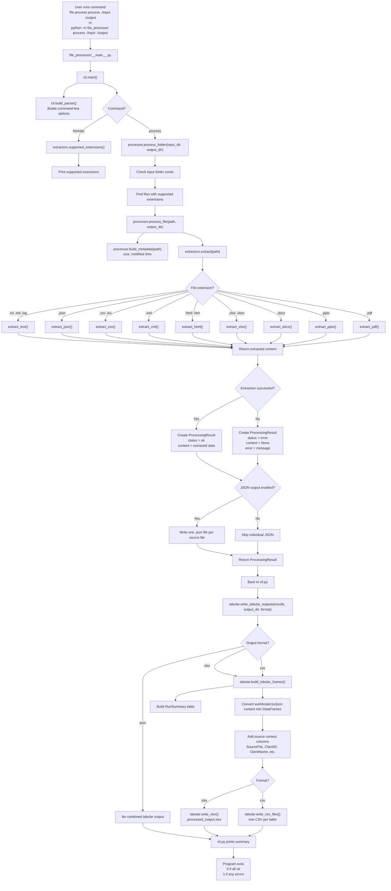

# Project Flow

```mermaid
flowchart TD
    A["User runs command<br/>file-process process ./input ./output<br/>or<br/>python -m file_processor process ./input ./output"]

    A --> B["file_processor/__main__.py"]
    B --> C["cli.main()"]

    C --> D["cli.build_parser()<br/>Builds command-line options"]
    C --> E{"Command?"}

    E -->|formats| F["extractors.supported_extensions()"]
    F --> G["Print supported extensions"]

    E -->|process| H["processor.process_folder(input_dir, output_dir)"]

    H --> I["Check input folder exists"]
    I --> J["Find files with supported extensions"]
    J --> K["processor.process_file(path, output_dir)"]

    K --> L["processor.build_metadata(path)<br/>size, modified time"]
    K --> M["extractors.extract(path)"]

    M --> N{"File extension?"}

    N -->|.txt .md .log| O["extract_text()"]
    N -->|.json| P["extract_json()"]
    N -->|.csv .tsv| Q["extract_csv()"]
    N -->|.xml| R["extract_xml()"]
    N -->|.html .htm| S["extract_html()"]
    N -->|.xlsx .xlsm| T["extract_xlsx()"]
    N -->|.docx| U["extract_docx()"]
    N -->|.pptx| V["extract_pptx()"]
    N -->|.pdf| W["extract_pdf()"]

    O --> X["Return extracted content"]
    P --> X
    Q --> X
    R --> X
    S --> X
    T --> X
    U --> X
    V --> X
    W --> X

    X --> Y{"Extraction successful?"}

    Y -->|Yes| Z["Create ProcessingResult<br/>status = ok<br/>content = extracted data"]
    Y -->|No| AA["Create ProcessingResult<br/>status = error<br/>content = None<br/>error = message"]

    Z --> AB{"JSON output enabled?"}
    AA --> AB

    AB -->|Yes| AC["Write one .json file per source file"]
    AB -->|No| AD["Skip individual JSON"]

    AC --> AE["Return ProcessingResult"]
    AD --> AE

    AE --> AF["Back to cli.py"]
    AF --> AG["tabular.write_tabular_outputs(results, output_dir, format)"]

    AG --> AH{"Output format?"}
    AH -->|json| AI["No combined tabular output"]
    AH -->|xlsx| AJ["tabular.build_tabular_frames()"]
    AH -->|csv| AJ

    AJ --> AK["Build RunSummary table"]
    AJ --> AL["Convert workbook/csv/json content into DataFrames"]
    AL --> AM["Add source context columns<br/>SourceFile, ClientID, ClientName, etc."]

    AM --> AN{"Format?"}
    AN -->|xlsx| AO["tabular.write_xlsx()<br/>processed_output.xlsx"]
    AN -->|csv| AP["tabular.write_csv_files()<br/>one CSV per table"]

    AI --> AQ["cli.py prints summary"]
    AO --> AQ
    AP --> AQ

    AQ --> AR["Program exits<br/>0 if all ok<br/>1 if any errors"]
```