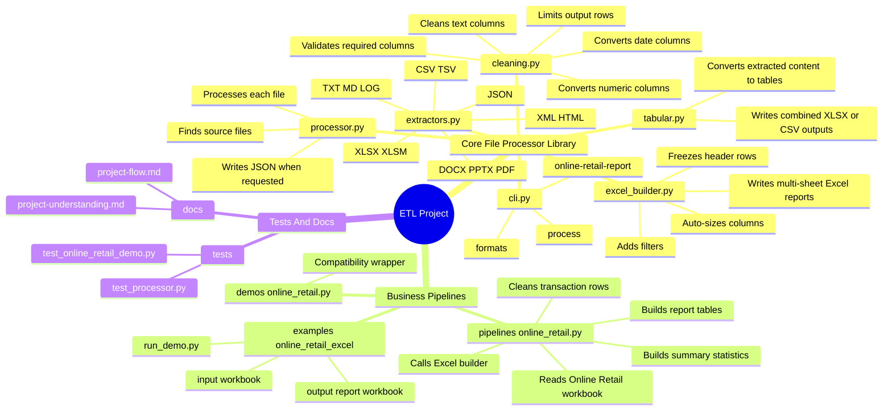
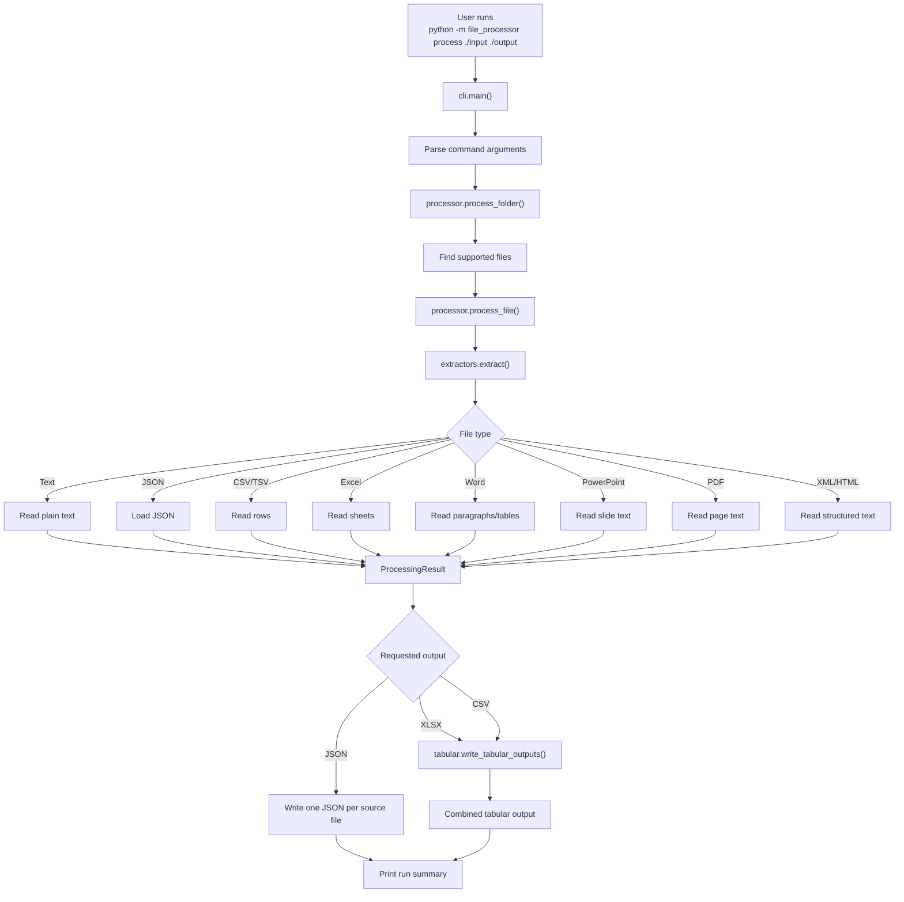
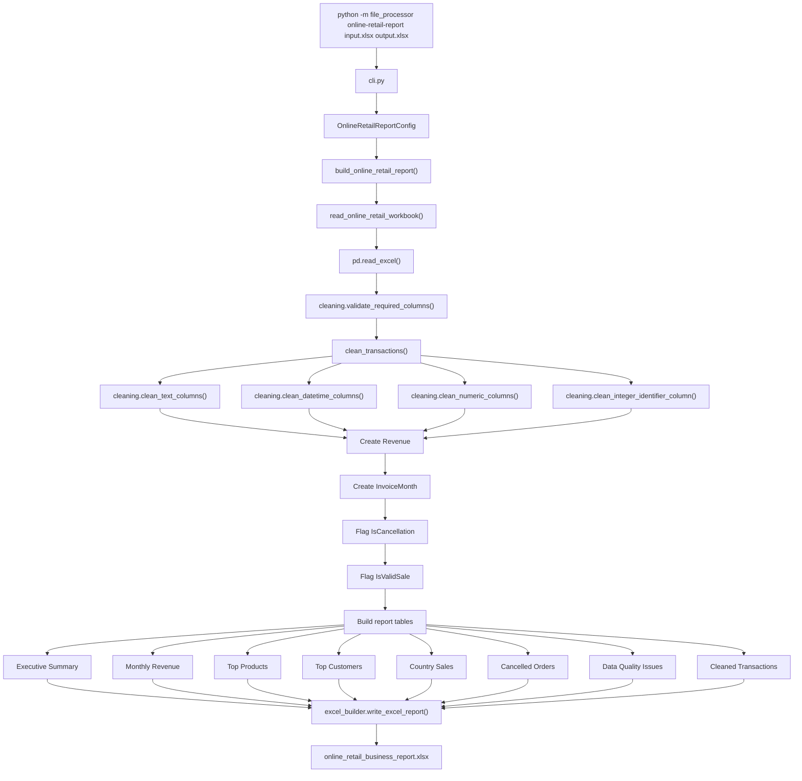
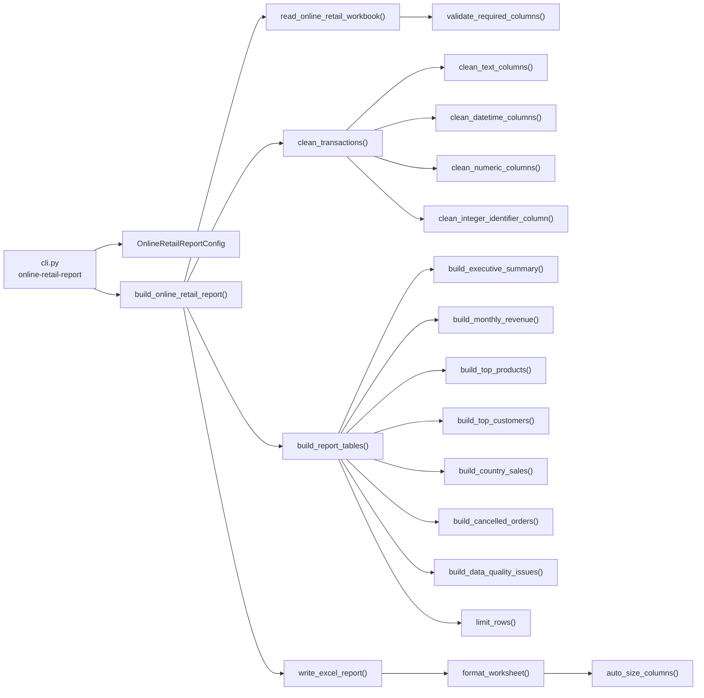
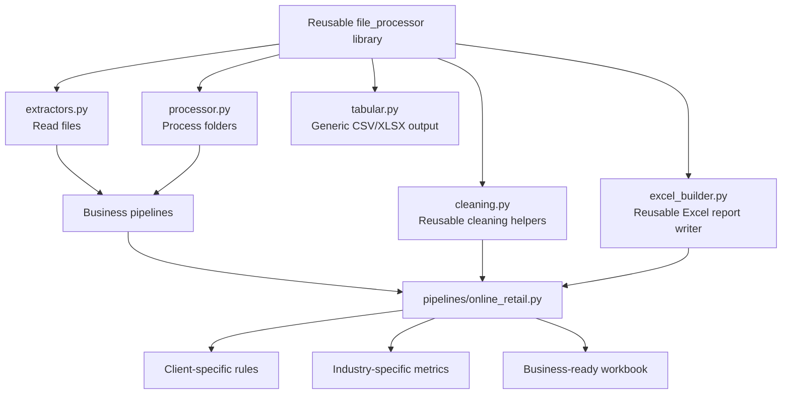

# Project Understanding Guide

This guide explains the current ETL project in plain language. The project now
has two connected parts:

- a reusable file processing library
- a business pipeline that turns a raw retail Excel workbook into a finished
  Excel report

## 1. Big Picture

The project goal is to automate messy business file processing.

The generic processor can read common file formats and produce structured
outputs. The Online Retail pipeline shows a more realistic client-style job:
take one messy Excel workbook, clean it, calculate useful business metrics, and
produce a polished multi-sheet Excel report.

```text
raw files -> extract -> clean -> transform -> report
```

For clients, this means fewer manual spreadsheet tasks. For recruiters, this
shows ETL thinking: ingestion, validation, cleaning, transformation, export, and
testing.

## 2. Current Project Map



## 3. Main CLI Commands

List supported file types:

```bash
python -m file_processor formats
```

Process a folder of supported files:

```bash
python -m file_processor process ./input ./output
```

Build the Online Retail business report:

```bash
python -m file_processor online-retail-report \
  "examples/online_retail_excel/input/Online Retail.xlsx" \
  "examples/online_retail_excel/output/online_retail_business_report.xlsx"
```

## 4. General File Processor Flow



## 5. Online Retail Pipeline Flow

The Online Retail pipeline is now part of the main package:

```text
file_processor/pipelines/online_retail.py
```

It uses reusable helpers from:

```text
file_processor/cleaning.py
file_processor/excel_builder.py
```



## 6. Function Call Map



## 7. Before And After Data Cleaning

### Raw Input Example

| InvoiceNo | StockCode | Description | Quantity | InvoiceDate | UnitPrice | CustomerID | Country |
|---|---|---|---:|---|---:|---:|---|
| `" 536365 "` | `" 85123A "` | `" WHITE HANGING HEART "` | 6 | `"2010-12-01 08:26"` | 2.55 | 17850 | `" United Kingdom "` |
| `"C536383"` | `"35004C"` | `"SET OF 3 COLOURED DUCKS"` | -1 | `"2010-12-01 09:49"` | 4.65 | 15311 | `"United Kingdom"` |
| `"536500"` | `"POST"` | null | 1 | `"bad date"` | 0 | null | null |

### After `clean_transactions()`

| InvoiceNo | StockCode | Description | Quantity | InvoiceDate | UnitPrice | CustomerID | Country | Revenue | InvoiceMonth | IsCancellation | IsValidSale |
|---|---|---|---:|---|---:|---:|---|---:|---|---|---|
| `"536365"` | `"85123A"` | `"WHITE HANGING HEART"` | 6 | 2010-12-01 08:26 | 2.55 | 17850 | `"United Kingdom"` | 15.30 | `"2010-12"` | false | true |
| `"C536383"` | `"35004C"` | `"SET OF 3 COLOURED DUCKS"` | -1 | 2010-12-01 09:49 | 4.65 | 15311 | `"United Kingdom"` | -4.65 | `"2010-12"` | true | false |
| `"536500"` | `"POST"` | `""` | 1 | missing date | 0 | missing | `"Unknown"` | 0.00 | missing month | false | false |

## 8. Why The Cleaning Helpers Matter

| Helper | What it does | Why it matters |
|---|---|---|
| `validate_required_columns()` | Checks that required input fields exist | Fails early when the client sends the wrong file shape |
| `clean_text_columns()` | Fills missing text and strips spaces | Prevents duplicate categories caused by extra spaces |
| `clean_numeric_columns()` | Converts numbers safely | Allows revenue and quantity calculations |
| `clean_datetime_columns()` | Converts dates safely | Enables monthly reporting and date ranges |
| `clean_integer_identifier_column()` | Keeps IDs as integers while allowing missing IDs | Good for customer IDs and account IDs |
| `limit_rows()` | Caps large output sheets | Keeps reports usable and file sizes reasonable |

## 9. Report Sheets

The Online Retail report writes these sheets:

| Sheet | Meaning |
|---|---|
| `Executive Summary` | High-level metrics such as raw rows, valid sales, customers, products, revenue, and date range |
| `Monthly Revenue` | Revenue, orders, customers, and units sold by month |
| `Top Products` | Highest-revenue products |
| `Top Customers` | Highest-revenue customers |
| `Country Sales` | Revenue and order metrics by country |
| `Cancelled Orders` | Rows identified as cancellations or returns |
| `Data Quality Issues` | Counts and percentages for missing or invalid data |
| `Cleaned Transactions` | Cleaned transaction rows, capped by the configured row limit |

## 10. Business Translation

### Short Pitch

This project turns messy business files into clean, structured, client-ready
outputs. It can process general files, and it also includes a realistic Excel
reporting pipeline for ecommerce transaction data.

### Client Version

This automation reads a raw sales workbook, cleans the data, separates returns
from valid sales, calculates revenue, builds business summary tables, and
delivers a formatted Excel report that is ready to review.

### Recruiter Version

This is an ETL-style Python project. It includes file ingestion, format-specific
extractors, reusable data cleaning utilities, a business-specific transformation
pipeline, Excel report generation, CLI commands, and tests.

## 11. Library Versus Pipeline



The important design change is that the Online Retail work is no longer just an
isolated demo. Its general pieces now live in the main program:

- cleaning helpers live in `file_processor/cleaning.py`
- Excel report formatting lives in `file_processor/excel_builder.py`
- the ecommerce workflow lives in `file_processor/pipelines/online_retail.py`

That is the shape we want for future client work: reusable platform pieces plus
small, focused business pipelines.
