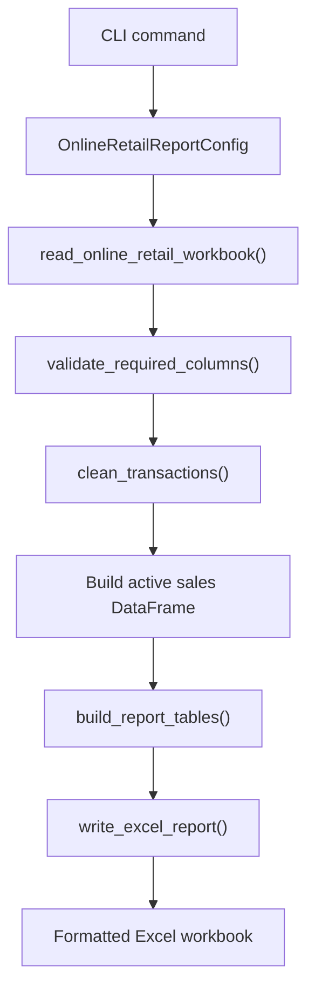
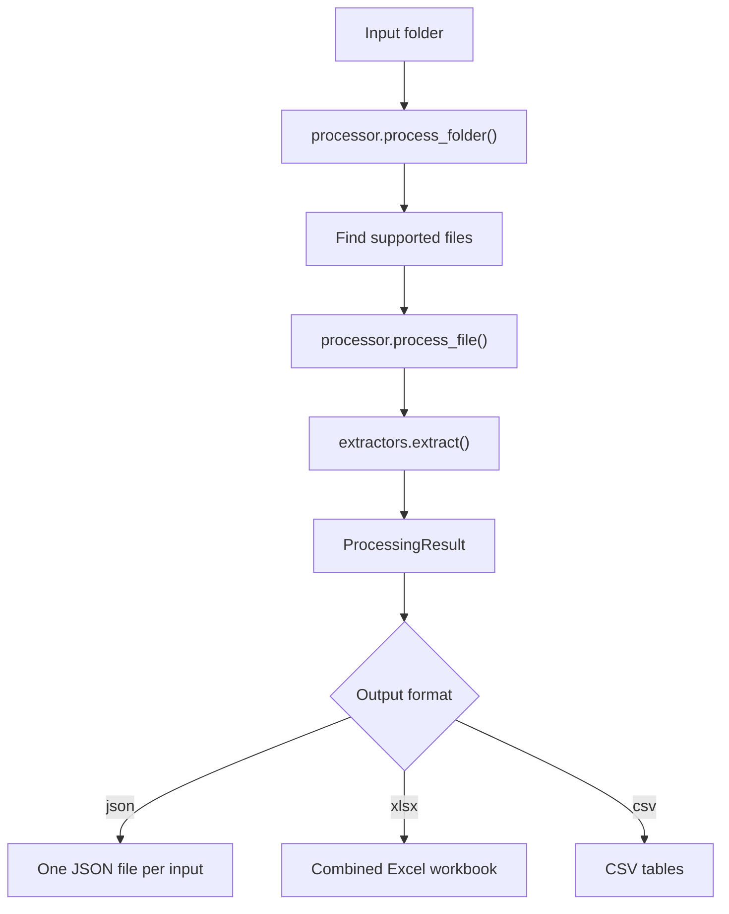

# Technical Design Document

## 1. Purpose

This project is an ETL-friendly file automation tool. It is designed to process
messy business files, extract usable data, clean and transform that data, and
produce structured outputs such as JSON, CSV, and Excel reports.

The project has two goals:

- demonstrate a reusable file processing framework
- demonstrate a realistic business pipeline through the Online Retail
  Excel-to-Excel report

The intended audience is small-business clients, recruiters, and future
developers who need to understand or extend the project.

## 2. System Overview

The system has three layers:

```text
CLI layer -> reusable processing library -> business-specific pipelines
```

The CLI layer lives in `file_processor/cli.py`. It exposes commands such as:

```bash
python -m file_processor formats
python -m file_processor process ./input ./output
python -m file_processor online-retail-report input.xlsx output.xlsx
```

The reusable processing library handles general file extraction, folder
processing, tabular output, common cleaning helpers, and Excel report building.

Business-specific pipelines use the reusable pieces to solve a particular
business problem. The current example is the Online Retail pipeline.

## 3. Package Structure

```text
file_processor/
  __main__.py
  cli.py
  processor.py
  extractors.py
  tabular.py
  cleaning.py
  excel_builder.py
  pipelines/
    online_retail.py
  demos/
    online_retail.py
examples/
  online_retail_excel/
    run_demo.py
    input/
    output/
tests/
docs/
```

## 4. Core Modules

### `cli.py`

This is the command-line entry point. It parses user commands and decides which
workflow to run.

Current commands:

| Command | Purpose |
|---|---|
| `formats` | Print supported file extensions |
| `process` | Process a folder of supported files |
| `online-retail-report` | Build the ecommerce Excel report |

### `processor.py`

This module coordinates generic file processing.

Responsibilities:

- validate the input folder
- find supported files
- process each file
- build metadata
- create `ProcessingResult` objects
- optionally write JSON output

The `ProcessingResult` dataclass is the main generic result contract.

### `extractors.py`

This module contains file-type-specific extraction logic.

Supported families:

- text: `.txt`, `.md`, `.log`
- structured text: `.json`, `.csv`, `.tsv`, `.xml`, `.html`
- Office files: `.xlsx`, `.xlsm`, `.docx`, `.pptx`
- PDF: `.pdf`

Each extractor returns a dictionary with a `kind` field and extracted content.
For example, Excel extraction returns workbook sheets and rows.

### `tabular.py`

This module converts generic `ProcessingResult` objects into tabular outputs.

It can write:

- combined Excel workbook
- one CSV file per table

It also adds source context columns such as source filename and client metadata
when available.

### `cleaning.py`

This module contains reusable cleaning helpers extracted from the Online Retail
demo and promoted into the main program.

Important functions:

| Function | Purpose |
|---|---|
| `validate_required_columns()` | Fail early if required input columns are missing |
| `clean_text_columns()` | Fill missing text and strip whitespace |
| `clean_numeric_columns()` | Convert values to numbers safely |
| `clean_datetime_columns()` | Convert values to datetimes safely |
| `clean_integer_identifier_column()` | Keep IDs as nullable integers |
| `limit_rows()` | Cap large output tables |

These functions are intentionally generic so future client pipelines can reuse
them.

### `excel_builder.py`

This module contains reusable Excel output functions.

Important functions:

| Function | Purpose |
|---|---|
| `write_excel_report()` | Write a dictionary of DataFrames to a multi-sheet workbook |
| `format_worksheet()` | Apply report-friendly worksheet formatting |
| `auto_size_columns()` | Adjust column widths |
| `unique_sheet_name()` | Keep worksheet names Excel-safe and unique |

This separates Excel formatting from business-specific logic.

## 5. Online Retail Pipeline

The Online Retail pipeline lives in:

```text
file_processor/pipelines/online_retail.py
```

It processes the UCI Online Retail Excel dataset and writes a business report.

Input:

```text
examples/online_retail_excel/input/Online Retail.xlsx
```

Output:

```text
examples/online_retail_excel/output/online_retail_business_report.xlsx
```

Run command:

```bash
python -m file_processor online-retail-report \
  "examples/online_retail_excel/input/Online Retail.xlsx" \
  "examples/online_retail_excel/output/online_retail_business_report.xlsx"
```

### Required Input Columns

The pipeline expects these columns:

```text
InvoiceNo
StockCode
Description
Quantity
InvoiceDate
UnitPrice
CustomerID
Country
```

If any required column is missing, the pipeline raises a `ValueError`.

### Cleaning Rules

The pipeline applies these cleaning rules:

- trim text fields
- fill missing descriptions with empty strings
- fill missing countries with `Unknown`
- convert invoice dates to datetimes
- convert quantity and unit price to numbers
- convert customer IDs to nullable integers
- calculate `Revenue = Quantity * UnitPrice`
- calculate `InvoiceMonth`
- flag cancellations
- flag valid sales

Cancellation logic:

```text
InvoiceNo starts with C OR Quantity < 0
```

Valid sale logic:

```text
not cancellation
and invoice date is present
and quantity > 0
and unit price > 0
and description is not blank
```

### Report Sheets

The generated workbook contains:

| Sheet | Purpose |
|---|---|
| `Executive Summary` | High-level counts and revenue metrics |
| `Monthly Revenue` | Revenue, orders, customers, and units sold by month |
| `Top Products` | Highest-revenue products |
| `Top Customers` | Highest-revenue customers |
| `Country Sales` | Revenue and order metrics by country |
| `Cancelled Orders` | Returns and cancellations |
| `Data Quality Issues` | Missing and invalid data checks |
| `Cleaned Transactions` | Cleaned transaction-level data |

## 6. Data Flow



## 7. Generic Processing Flow



## 8. Extending The Project

### Add a New File Type

1. Add an extractor function in `extractors.py`.
2. Register the extension in `EXTRACTORS`.
3. Add or update tests.
4. Update the README supported formats list if needed.

### Add a New Business Pipeline

1. Create a new file in `file_processor/pipelines/`.
2. Define a config dataclass.
3. Read and validate the input.
4. Reuse helpers from `cleaning.py`.
5. Build report tables as DataFrames.
6. Write the workbook with `excel_builder.write_excel_report()`.
7. Add a CLI subcommand in `cli.py`.
8. Add an example folder under `examples/`.
9. Add tests.

Suggested shape:

```text
file_processor/pipelines/client_invoices.py
examples/client_invoices/
tests/test_client_invoices.py
```

## 9. Testing Strategy

The tests are designed around small synthetic files rather than large real
datasets. This keeps tests fast and repeatable.

Current test coverage includes:

- supported extension detection
- generic folder processing
- JSON serialization of Excel dates
- tabular Excel output
- tabular CSV output
- Online Retail report generation using a tiny sample workbook
- reusable cleaning helpers
- reusable Excel builder formatting

The full UCI workbook is used as a real demo artifact, but it is not required
for the automated tests.

## 10. Known Limitations

- Some local virtual environments may be stale if Python was moved or removed.
- The full Online Retail input workbook is large.
- The generic processor extracts many formats, but most business intelligence
  logic currently exists only in the Online Retail pipeline.
- PDF, Word, and PowerPoint extraction is text-oriented, not semantic.
- The project currently has a CLI, not a graphical user interface.

## 11. Future Improvements

Useful next steps:

- add pipeline configuration files
- add richer logging
- add client-friendly error reports
- add a second demo using CSV plus Excel
- add invoice or inventory-specific pipelines
- add charts to generated Excel reports
- add a small web UI for non-technical users
- remove tracked Python cache files from the repository history in a future
  cleanup branch

## 12. How To Explain This Project

Client version:

> This tool automates repetitive business file processing. It takes messy raw
> files, cleans them, checks for data issues, and produces a ready-to-use Excel
> report.

Recruiter version:

> This is a Python ETL project with a CLI, modular file extractors, reusable
> cleaning functions, tabular output generation, and a business-specific Excel
> reporting pipeline.

Developer version:

> The reusable core handles extraction and output. Business pipelines compose
> the core cleaning and report-building helpers into domain-specific workflows.
